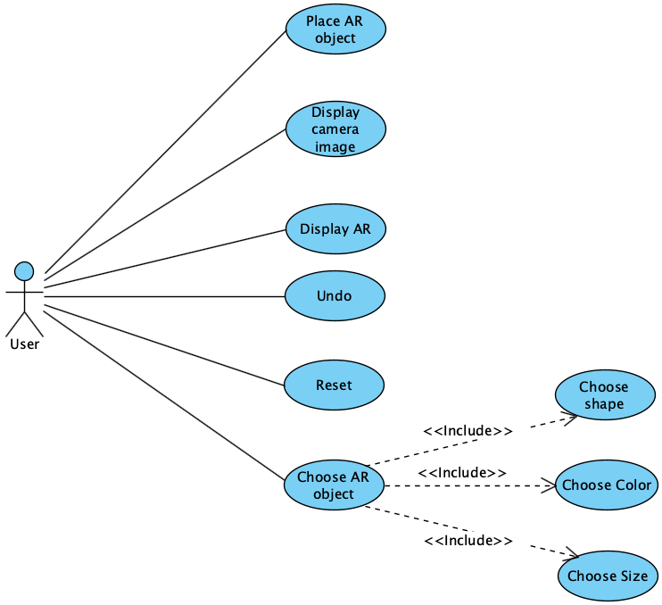
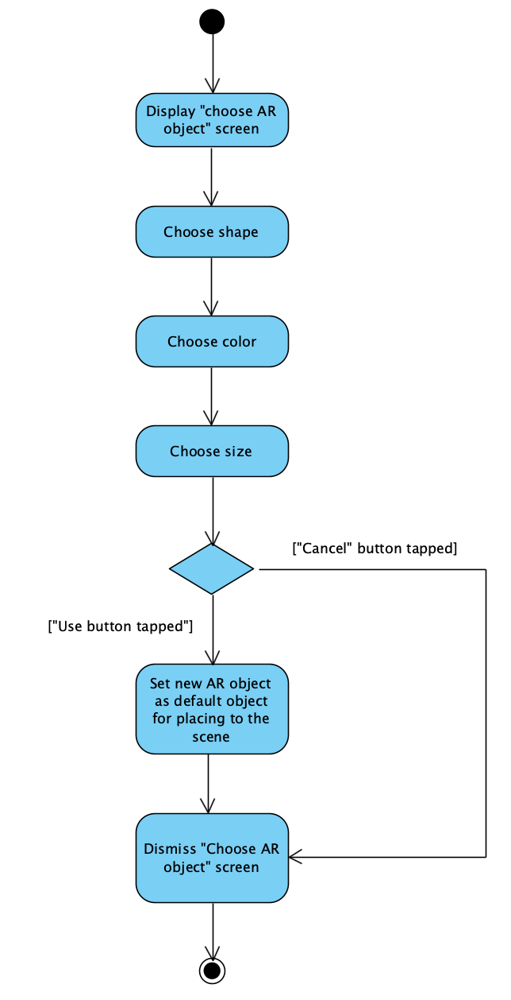
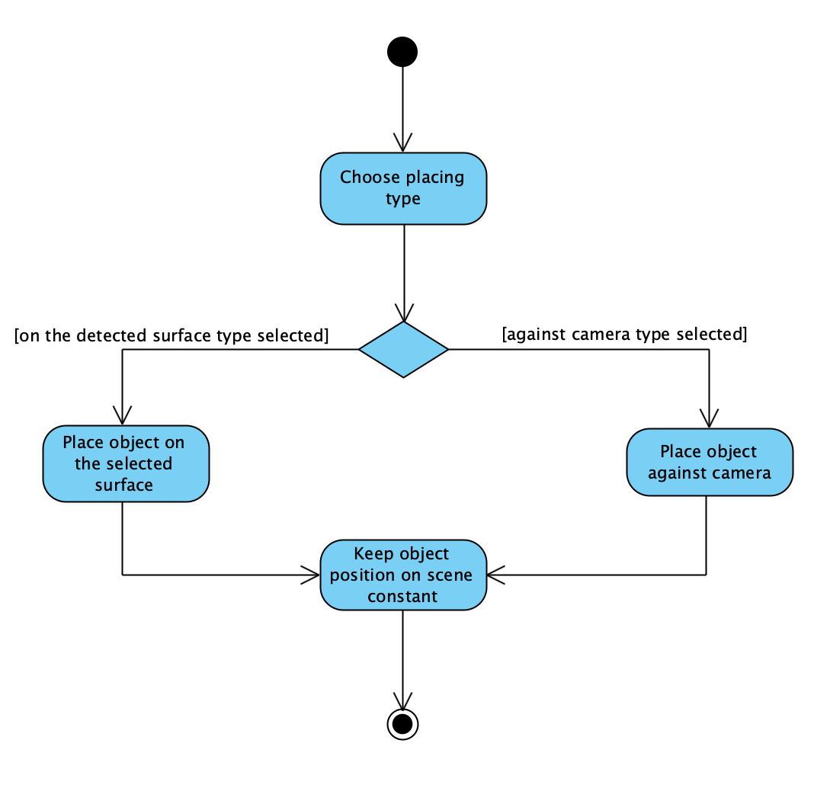
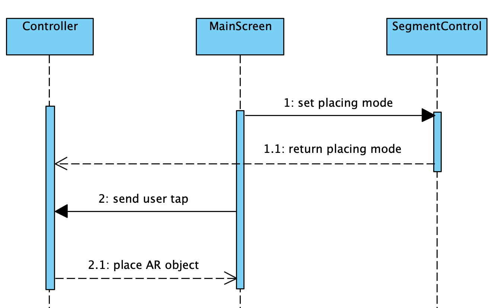

# UML Diagrams

# Content
1. [Use case diagram](#use_case_diagram)  
   1.1 [Actors](#actors)  
   1.2 [Use cases](#use_cases)  
   1.2.1 [Display camera image](#display_camera_image)  
   1.2.2 [Display AR](#display_ar)  
   1.2.3 [Choose AR object](#choose_ar_object)  
   1.2.4 [Place AR object](#place_ar_object)  
   1.2.5 [Undo](#undo)  
   1.2.6 [Reset](#reset)  
2. [Activity diagrams](#activities_diagrams)  
   2.1 [Choose AR object](#choose_ar_object_activity)  
   2.2 [Place AR object](#place_ar_object_activity)  
3. [Sequence diagrams](#sequence_diagrams)  
   3.1 [Choose AR object](#choose_ar_object_sequence)  
   3.2 [Place AR object](#place_ar_object_sequence)  
4. [State diagram](#state_diagram)  
5. [Class diagram](#class_diagram)  
6. [Components diagram](#components_diagram)  

<a name="use_case_diagram"/>

# 1. Use case diagram
  

<a name="actors"/>

## 1.1 Actors
User - Person who launched the application.

<a name="use_cases"/>

## 1.2 Use cases

<a name ="display_camera_image"/>

### 1.2.1 Display camera image
**Description.** Use case "Display camera image" allows user to receive current camera image.

**Pre-conditions.**
User agreement to use the camera is required.

**Main flow.**  
1.Display the camera image on main screen in real time.  
2.End.

**Addition information.** If there is no user agreement to use the camera an alternative flow is executed.

**Alternative Flow А1.**  
1.Show an alert that the appllication can't work without a camera.  
2.End.

<a name ="display_ar"/>

### 1.2.2 Display AR
**Description.** Use case "Display AR" allows user to see AR objects on screen.

**Pre-conditions.**
User agreement to use the camera is required.

**Main flow.**  
1.Display AR objects and keep their position on scene constant.  
2.End.

**Addition information.** If there is no user agreement to use the camera an alternative flow is executed.

**Alternative Flow А1.**  
1.Show an alert that the appllication can't work without a camera.  
2.End.

<a name ="choose_ar_object"/>

### 1.2.3 Choose AR object
**Description.** Use case "Choose AR object" allows user to add new AR objects to the scene.

**Pre-conditions.**
"Display AR" and "Display camera image" use cases are completed.

**Main flow.**  
1.User taps the "Object" button on the main screen.  
2.Application presents "Choose AR object" screen.  
3.User chooses shape from basic shapes and taps on choosed.  
4.User chooses size of AR object from 3 sezes: small, medium or large. And taps on appropirate button.  
5.If user want to choose custom color he taps on current sample of color in the middle of screen. In this case an alternative flow A1 is executed.  
6.If user taps "cancel" button an alternative flow A2 is executed.  
7.User taps the "Use" button.  
8.Application set new AR object as default object for placing to the scene.  
9.Application dismiss "Choose AR object" screen.  
10.End.

**Alternative flow A1.**  
1."Color Picker" screen opens.  
2.User selects a color by clicking on the gradient image.  
3.User selects a brightness level using the slider.  
4.In the upper left corner the current color is displayed.  
5.If user taps "cancel" button an alternative flow A3 is executed.  
6.Application set new color as AR object color.  
7.Application dismiss "Color picker" screen.  
8.End.

**Alternative flow A2.**  
1.Return to main screen without saving changes.  
2.End.

**Alternative flow A3.**  
1.Return to "Choose AR object" screen without saving changes.  
2.End.

<a name ="place_ar_object"/>

### 1.2.4 Place AR object
**Description.** Use case "Place AR object" allows user to place the AR object against the camera at a distance of 20 centimeters. Or on the detected surface.

**Pre-conditions.**
"Display AR" and "Display camera image" use cases are completed.

**Main flow.**  
1.User chooses AR object placing type from 2 tupes: against camera and on the detected surface. And taps on appropirate button in the lower left corner of the main screen.  
1.If against camera placed type are selected an alternative flow is executed.    
1.User chooses surface for placing AR object and taps on corresponding point on the screen.  
1.Application place the AR object on the detected surface and keep its position on scene constant.  
2.End.

**Alternative flow.**  
1.User taps on the screen.  
1.Application place the AR object object against the camera at a distance of 20 centimeters and keep its position on scene constant.  
2.End.

<a name ="undo"/>

### 1.2.5 Undo
**Description.** Use case "Undo" allows user to delete last added AR object.

**Pre-conditions.**
"Add AR object" use cases is completed.

**Main flow.**  
1.Delete last added AR object from scene. 
2.End.

**Addition information.** If "Add AR object" use cases isn't completed an alternative flow is executed.

**Alternative flow.**  
1.Turn on vibration on the phone for half second.  
2.End.

<a name ="reset"/>

### 1.2.6 Reset
**Description.** Use case "Reset" allows user to delete all added AR objects.

**Pre-conditions.**
"Add AR object" use cases is completed.

**Main flow.**  
1.Delete all added AR objects from scene.  
2.End.

**Addition information.** If "Add AR object" use cases isn't completed an alternative flow is executed.

**Alternative flow.**  
1.Turn on vibration on the phone for half second.  
2.End.

<a name = "activities_diagrams"/>

## 2. Activity diagrams

<a name = "choose_ar_object_activity"/>

### 2.1 Choose AR object

  

<a name = "place_ar_object_activity"/>

### 2.2 Place AR object

  

<a name = "sequence_diagrams"/>

## 3. Sequence diagrams

<a name = "choose_ar_object_sequence"/>

### 2.1 Choose AR object

  

<a name = "place_ar_object_sequence"/>

### 2.2 Place AR object

  

<a name = "state_diagram"/>

## 4. State diagram

<a name = "class_diagram"/>

## 5. Class diagram

 

<a name = "components_diagram"/>

## 6. Components diagram

 

